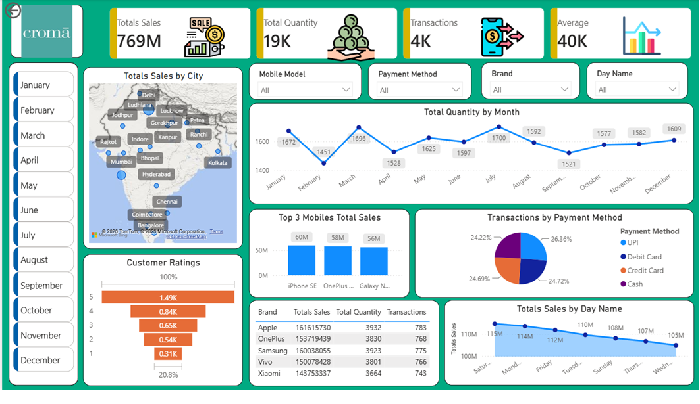

# 📊 Croma Sales Dashboard

## 📌 Project Overview
The **Croma Sales Dashboard** is a Power BI project designed to analyze and visualize retail sales data.  
This dashboard provides clear insights into sales performance, transactions, and key business metrics to support data-driven decision-making.

---

## 🎯 Objectives
- Analyze overall sales performance  
- Track total transactions and quantity sold  
- Identify trends in revenue and customer activity  
- Provide an easy-to-understand visual dashboard  

---

## 📂 Dataset Information

### 📁 Dataset Name:
Mobile Sales Dataset

### 📊 Dataset Description:
The dataset contains sales-related information from a retail store (Croma), including:

- Product details  
- Sales amount  
- Quantity sold  
- Transaction records  
- Date of purchase  

### 🧾 Columns Included:
- `Product Name` – Name of the product  
- `Category` – Product category  
- `Quantity` – Number of units sold  
- `Total Sales` – Revenue generated  
- `Transaction ID` – Unique transaction identifier  
- `Date` – Date of purchase  

---

## 📷 Dashboard Preview

### 🖥 Full Dashboard View

----

---

## 📈 Key Metrics Shown
- 🟢 Total Sales  
- 🟢 Total Quantity Sold  
- 🟢 Number of Transactions  
- 🟢 Average Sales Value  

---

## 📊 Key Insights
- Identified top-performing products and categories  
- Analyzed customer purchasing trends  
- Observed sales growth patterns over time  
- Improved understanding of business performance  

---

## 🛠 Tools & Technologies Used
- **Power BI** – Data visualization & dashboard creation  
- **Microsoft Excel** – Data cleaning and preprocessing  

---

## ⚙️ Process Workflow
1. Data Collection from Excel dataset  
2. Data Cleaning & Preparation  
3. Data Modeling in Power BI  
4. Creating Interactive Visualizations  
5. Dashboard Design & Layout  

---

## 📁 Project Files
- `Croma Store Dashboard.pbix` → Power BI dashboard file  
- `Mobile_Sales_Dataset_Dashboard.xlsx` → Dataset  
- `images/` → Dashboard images  

---

## 🚀 How to Use
1. Download the `.pbix` file  
2. Open it in Power BI Desktop  
3. Explore the dashboard visuals and insights  

---

## 📌 Future Improvements
- Add more advanced analytics  
- Include customer segmentation  
- Connect with real-time data sources  

---

## 👨‍💻 Author
**Aditya Raj**  
Aspiring Data Analyst  

---

## ⭐ If you like this project
Give it a ⭐ on GitHub and share your feedback!
